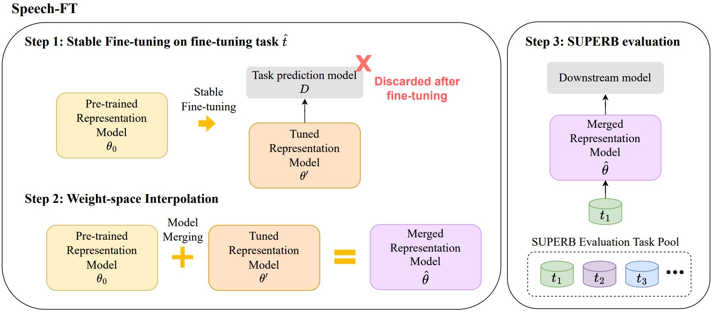
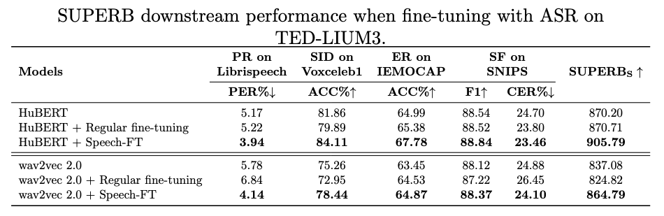

# 🚀 Speech-FT
This is the official repository of the paper published in **IEEE Transactions on Audio, Speech, and Language Processing (TASLP)**:
[Speech-FT: Merging Pre-trained and Fine-Tuned Speech Representation Models for Cross-Task Generalization](https://ieeexplore.ieee.org/document/11263888). 

- **Speech-FT is a supervised fine-tuning method designed to enhance pre-trained speech encoders**. 
- It effectively addresses the challenge of fine-tuning speech encoders while preserving cross-task generalization ability. 

## 🧐 Methodology


## 🎯 Results of Speech-FT

When fine-tuning HuBERT on ASR with TED-LIUM, Speech-FT reduces the PER from 5.17% to 3.94% and improves the SID accuracy from 81.86% to 84.11%.

Please see [the paper](https://ieeexplore.ieee.org/document/11263888) for full SUPERB evaluation results. 

## 💾 Model Checkpoint

Model checkpoints when fine-tuning with ASR on TED-LIUM3
| Models | URL |
| :--- | :--- |
| HuBERT + Speech-FT | [link](https://drive.google.com/file/d/13yiv5-6SY4dIMarCidJ0FKBPcID1iKG_/view?usp=sharing) |
| wav2vec 2.0 + Speech-FT | [link](https://drive.google.com/file/d/1d8412DKVFeS8vRzE9qL-gGz4IFs2EjQ9/view?usp=sharing) |

## ⚙️ Quick Start  
Extracting speech features with our encoders!
**🚧 Work in progress...**

## 🔥 Fine-tuning & Merging 
See [docs/train.md](docs/train.md) for more details.

## 📚 Citation

```
@article{lin2025speechft,
  author={Lin, Tzu-Quan and Huang, Wei-Ping and Tang, Hao and Lee, Hung-yi},
  journal={IEEE Transactions on Audio, Speech and Language Processing}, 
  title={Speech-FT: Merging Pre-trained And Fine-Tuned Speech Representation Models For Cross-Task Generalization}, 
  year={2025},
  volume={},
  number={},
  pages={1-15},
  doi={10.1109/TASLPRO.2025.3635827}
}
```

## 👥 Contributors
Tzu-Quan Lin, Wei-Ping Huang, Hao Tang, Hung-yi Lee