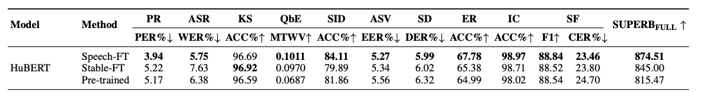

# Speech-FT
This is the official repository of the paper:
[Speech-FT: Merging Pre-trained and Fine-Tuned Speech Representation Models for Cross-Task Generalization](https://arxiv.org/abs/2502.12672). 

Speech-FT effectively tackles the challenge of fine-tuning speech representation models while maintaining their cross-task generalization ability. When fine-tuning HuBERT on ASR, Speech-FT reduces PER from 5.17% to 3.94%, lowers WER from 6.38% to 5.75%, and improves SID accuracy from 81.86% to 84.11%. Speech-FT provides a simple yet powerful solution for further refining speech representation models after pre-training.

## Installation
This codebase is built upon [s3prl](https://github.com/s3prl/s3prl/tree/main).  
Please clone the s3prl repository into `S3PRL_ROOT` and copy the modified files using:
```
cp -r s3prl_modified/* S3PRL_ROOT/s3prl/
```
Then, install s3prl manually (python=3.9 is recommended):
```
cd S3PRL_ROOT
pip install -e ".[all]"
```
## Fine-tune Speech Representation Models with Speech-FT
Speech-FT consists of two elements: **stable fine-tuning** and **weight-space interpolation**.

### Stable Fine-Tuning (Stable-FT)
To perform stable fine-tuning of HuBERT on ASR with TED-LIUM, run the following command: 
```
python3 S3PRL_ROOT/s3prl/preprocess/preprocess_ted.py -o S3PRL_ROOT/s3prl/data/ted
bash finetune_s3prl_model.sh python3 hubert asr_ted train asr_ted_hubert S3PRL_ROOT/s3prl/downstream/asr_ted/config_finetune.yaml S3PRL_ROOT
```
Note that you should use an absolute path instead of a relative path.

### Weight-Space Interpolation
Modify the `finetune_model_paths` and `output_dir` entries in the merging config file (e.g., `merge_config/ted_asr/hubert_alpha_0.25.yaml`).  
- `finetune_model_paths`: a list of fine-tuned model paths generated from stable fine-tuning  
- `output_dir`: the directory to save the interpolated model

Then run:
```
python3 merge_model.py -c merge_config/ted_asr/hubert_alpha_0.25.yaml
```

## Results of Speech-FT and Model Checkpoint

When fine-tuning HuBERT on ASR with TED-LIUM, Speech-FT reduces the PER from 5.17% to 3.94%, lowers the WER from 6.38% to 5.75%, and improves the SID accuracy from 81.86% to 84.11%. The full evaluation on the SUPERB benchmark is shown below:  


Download the model checkpoint fine-tuned with Speech-FT on ASR with TED-LIUM [here](https://drive.google.com/file/d/13yiv5-6SY4dIMarCidJ0FKBPcID1iKG_/view?usp=sharing).
